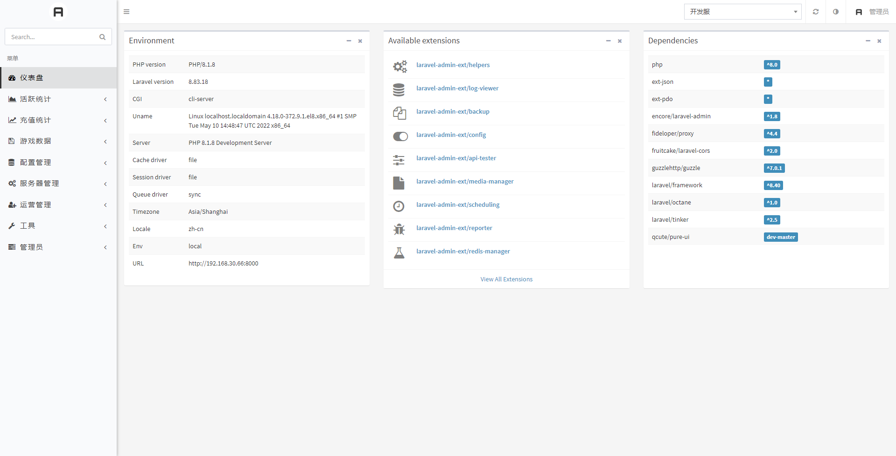

# Use PureUI in laravel-admin

Pure-UI is a Pure Design extension for [laravel-admin](https://github.com/z-song/laravel-admin).

## View

  

  

## Requirements

* laravel-admin >= 1.7.0

## Installation

```
composer require qcute/pure-ui

php artisan vendor:publish --tag=laravel-admin-pure-ui
```

## Update

```bash
composer update qcute/pure-ui

php artisan vendor:publish --tag=laravel-admin-pure-ui --force
```

## Configurations (Optional)

Add `extensions` option in your `config/admin.php` configuration file:

```
'extensions' => [
    // If the value is set to false, this extension will be disabled
    'pure-ui' => [ 'enable' => true ]
]
```

## Use

Just **Refresh** your browser.


## License

Licensed under [The GPL V3.0 License (GPL)](LICENSE).
